# Scripts de bash para AWS CLI

En esta práctica se realizan scripts para lanzar instancias para frontend y backend en el servicio EC2 de AWS con la herramienta AWS-CLI, que debe ser instalada y configurada con la región de Amazon y nuestros credenciales.


Para los siguientes scripts, utilizaremos un archivo de variables de entorno con los siguientes datos:

```bash
AMI_ID=ami-0c7217cdde317cfec
COUNT=1
INSTANCE_TYPE=t2.small
KEY_NAME=vockey

SECURITY_GROUP_FRONTEND=frontend-sg
SECURITY_GROUP_BACKEND=backend-sg

INSTANCE_NAME_FRONTEND=frontend
INSTANCE_NAME_BACKEND=backend
```


## Script para crear grupos de seguridad

Para crear los grupos de seguridad utilizaremos el comando `aws ec2 create-security-group` pasando como parámetros el nombre del grupo y su descripción.

Posteriormente, para cada grupo, añadiremos reglas de entrada con el comando `aws ec2 authorize-security-group-ingress`, especificando en los paŕametros el protocolo, direcciones IP y puerto.

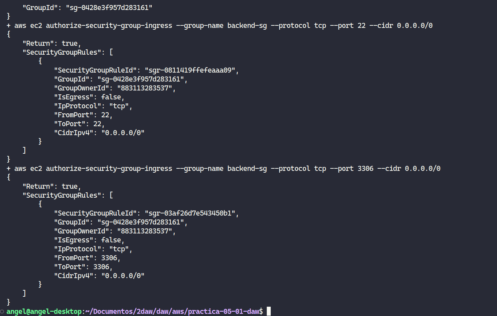

Después de ejecutar el script, podemos ver las reglas aplicadas en el grupo de seguridad del frontend.

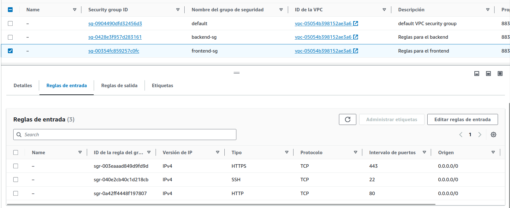

En el backend también se han aplicado:

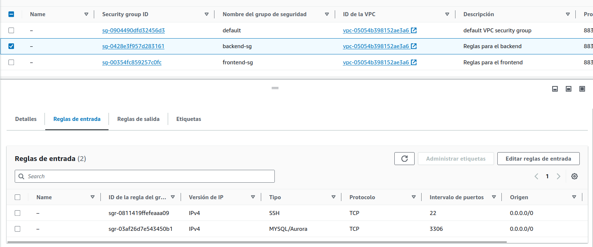


## Script para crear instancias

Para lanzar instancias utilizaremos el comando `aws ec2 run-instances` pasando como parámetro el grupo de seguridad correspondiente a cada instancia, nombre, imagen y número de instancias.

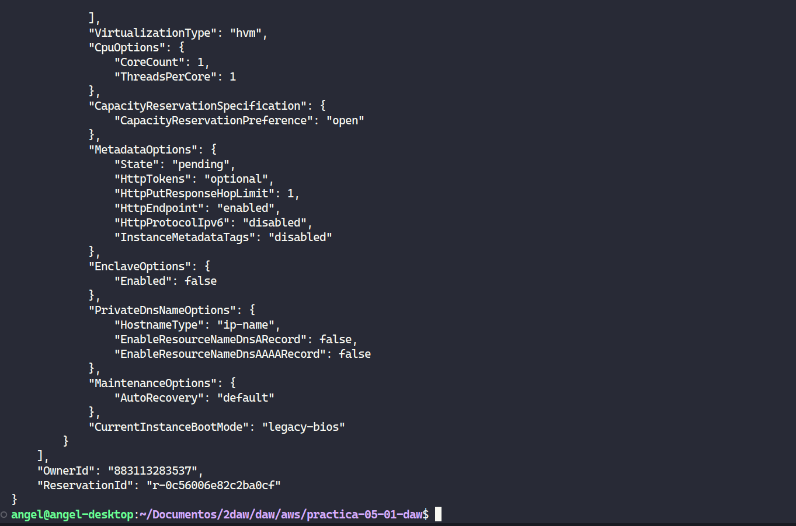

Al ejecutar el script se crearán las máquinas de frontend y backend:

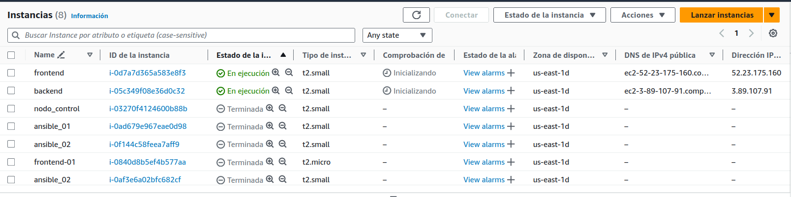

## Script para crear IP elástica

Con el comando `aws ec2 describe-instances` buscaremos el ID de la instancia de frontend (por su nombre) y con el comando `aws ec2 allocate-address` le asociaremos una dirección IP elástica.

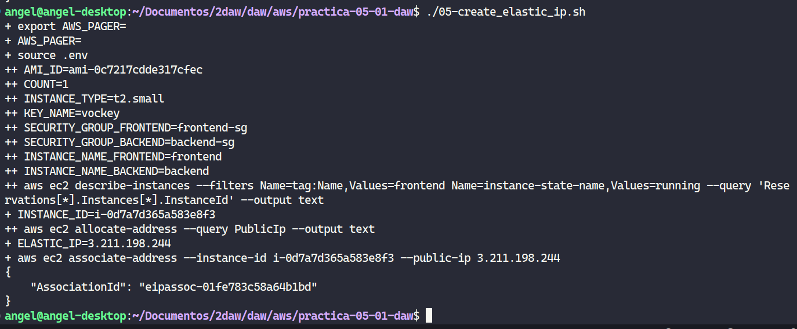

En la siguiente imagen se puede ver que se ha generado una IP elástica para la instancia del frontend:

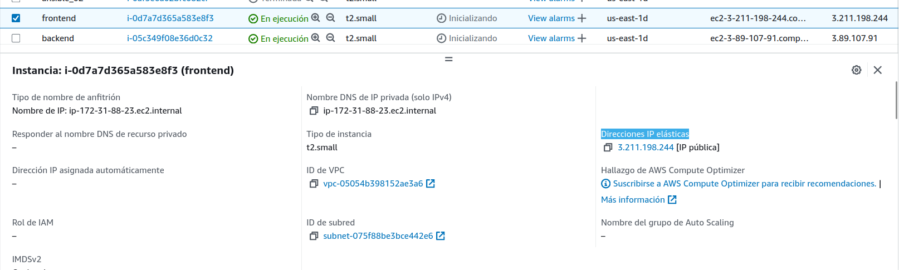


## Script para borrar instancias

Para borrar las instancias de este proyecto en concreto guardaremos en variables la salida del comando `aws ec2 describe-instances` (especificando por paŕametro el nombre de la instancia del frontend y backend). Posteriormente, utilizaremos el comando `aws ec2 terminate-instances` con los IDs guardados previamente. 

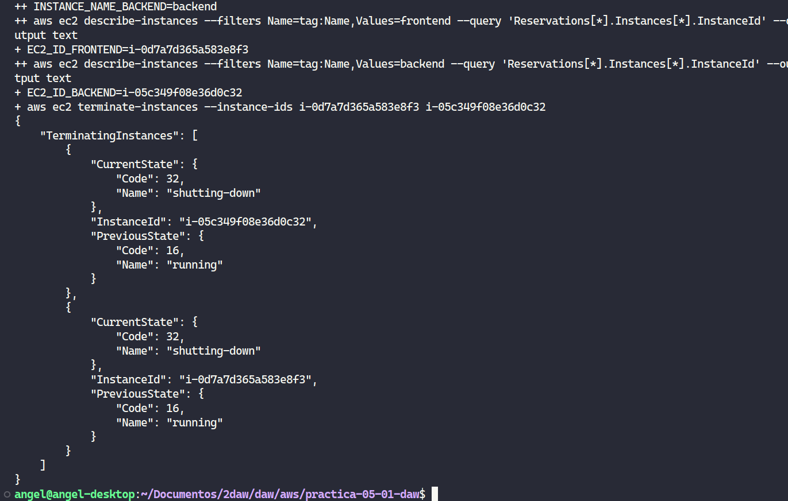

Después de ejecutar el comando veremos que las instancas aparecerán como *terminadas*:

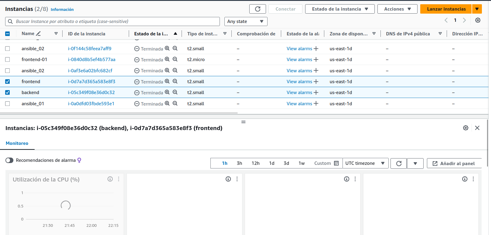


## Script para borrar grupos de seguridad

Puesto que AWS-CLI no nos permite eliminar grupos de seguridad en uso utilizaremos el comando `aws ec2 describe-security-groups` para guardar en una variable los ID de todos los grupos de seguridad y luego ejecutaremos el comando `delete-security-group` en un bucle para borrarlos todos (los que están siendo utilizados y el *default* no se borrarán).  

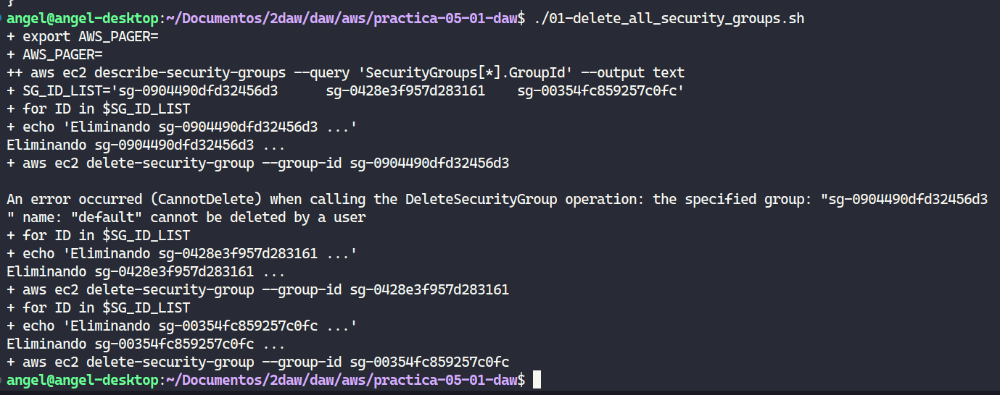

Grupos de seguridad borrados:

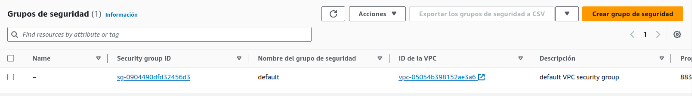

## Script para borrar IPs elásticas

Para borrar las IPs elásticas no utilizadas guardaremos en una variable la salida del comando `aws ec2 describe-instances` (buscando las IPs no asociadas). Posteriormente, ejecutaremos el comando `aws ec2 release-address` sobre la lista de IDs.

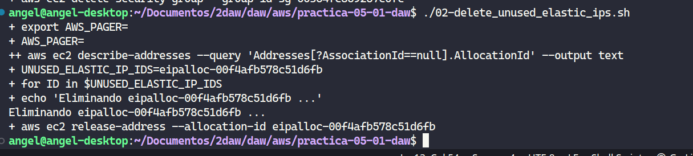

IPs elásticas eliminadas después del comando:

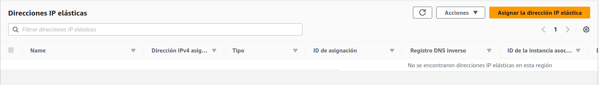